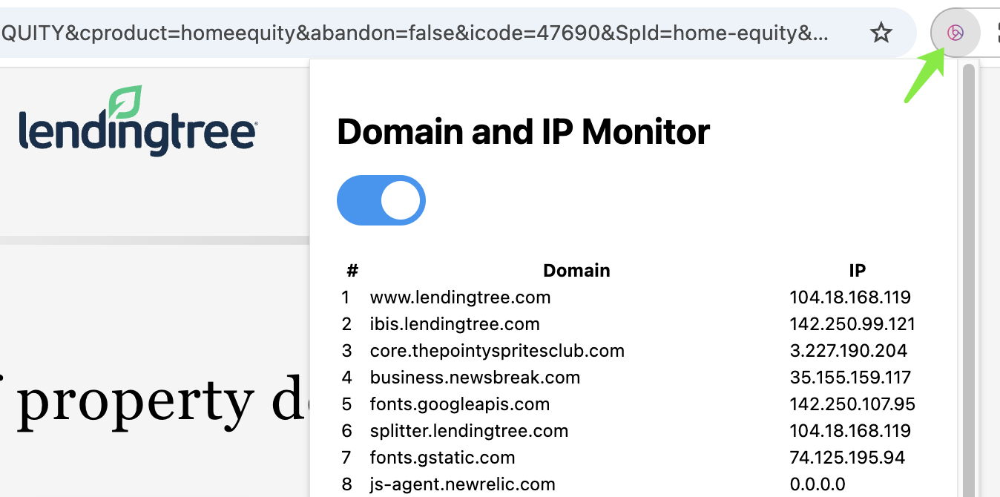

# Domain and DNS Record extension for Chrome DEV

> :exclamation: Only for Chrome `Dev Channel` or Newer
> [Download Chromious](https://www.chromium.org/getting-involved/dev-channel/)

## Features

> This Chrome Extension allows you to view the DNS and Domain information of the current tab.
> I create this extension to help me add some custom rules for IPs on my router also for self-hosted DNS server to resolve some domains with specific up stream DNS resolver.

## Installation

- Clone this repo
- Enable Developer Mode for Chrome Dev
- Load the extension in Chrome Dev
- Toggle DNS and Domain info On for the current tab

## Screenshots

